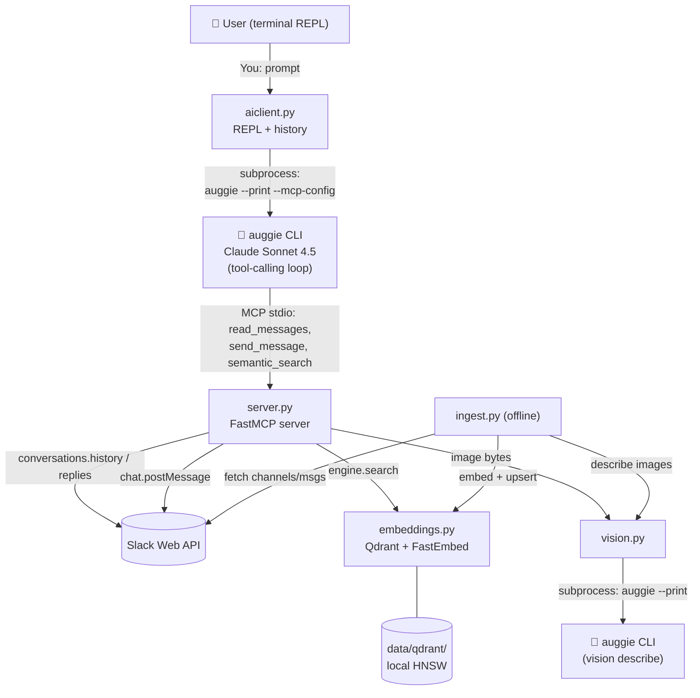

# 🤖 Slack MCP Agent (Auggie-powered)

An AI Slack assistant built on the **Model Context Protocol (MCP)**. It reads messages, sends messages, semantically searches every indexed channel, describes shared images with vision AI, and surfaces thread context — driven by the `auggie` CLI as the LLM agent.

---

## 📐 Architecture & Data Flow



**The turn-loop in one paragraph:** you type a prompt → `aiclient.py` prepends the system instructions + short rolling transcript → it spawns `auggie --print` with an MCP config that points at `server.py` → auggie runs the tool-calling loop (calling `read_messages` / `send_message` / `semantic_search` as needed) until it produces a final answer → `aiclient.py` captures stdout and prints it in the REPL. The ingest pipeline is offline and runs separately.

---

## 🧰 Components — what each file does and why

| File | Role | Why this tool / choice |
|---|---|---|
| `aiclient.py` | Interactive REPL; delegates each turn to `auggie` via subprocess | Auggie is the only working Augment surface on this tenant (direct HTTP API 404s). Auggie is itself MCP-capable, so we don't re-implement tool-calling. |
| `server.py` | MCP server (`FastMCP`) exposing `read_messages`, `send_message`, `semantic_search` | FastMCP gives a tiny stdio server with decorator-registered tools — loaded by auggie via `--mcp-config`. |
| `embeddings.py` | Qdrant + FastEmbed engine; also fetches Slack channels/messages | `qdrant-client[fastembed]` bundles a local persistent vector DB + ONNX embeddings — no GPU, no server. Model `BAAI/bge-small-en-v1.5` (384-dim) is small, fast, strong on semantic search. |
| `ingest.py` | Builds or incrementally updates the index | Enriches parent messages with all their replies (and replies with parent text) so semantic search returns the whole thread — the question *and* the answer together. |
| `vision.py` | Describes an image by shelling out to `auggie` | The tenant's Augment Vision HTTP API 404s; auggie-via-CLI works and gives rich descriptions incl. OCR-style text extraction. |
| `fetch_channels.py` | Dumps `channel-name → id` to `channels.json` | Lets the agent resolve human-readable channel names at turn time. |
| `search_cli.py` | Run semantic search without the AI agent | Fast sanity / debug tool independent of auggie. |
| `data/qdrant/` | Auto-persisted vector store | Survives restarts; no external Qdrant server needed. |
| `data/last_indexed.json` | Per-channel high-watermark timestamp | Used by `ingest.py --update` for incremental ingestion. |

---

## 🛠️ Step 1 — Create a Slack App

1. Go to <https://api.slack.com/apps> → **Create New App → From Scratch**
2. Under **OAuth & Permissions → Bot Token Scopes** add:

   | Scope | Purpose |
   |---|---|
   | `channels:history` | Read public channel messages |
   | `channels:read` | List public channels |
   | `chat:write` | Send messages |
   | `files:read` | Download shared images |
   | `groups:history` | Read private channel messages |

3. **Install to Workspace** → copy the **Bot User OAuth Token** (`xoxb-…`)
4. Invite the bot to each channel: `/invite @YourBotName`

---

## 🤖 Step 2 — Install & Authenticate Auggie

Auggie is the LLM agent + tool-caller. Both `aiclient.py` and `vision.py` shell out to it.

```bash
# Node 18+ is required by @augmentcode/auggie
npm install -g @augmentcode/auggie

# Interactive browser login (stores credentials locally)
auggie login

# Sanity check — should print the model list
auggie model list
```

---

## ⚙️ Step 3 — Configure Environment

```bash
cp .env.example .env
```

Edit `.env` and fill in:

| Key | Required | Purpose |
|---|---|---|
| `SLACK_BOT_TOKEN` | ✅ | `xoxb-…` token from Step 1 |
| `AUGMENT_MODEL` | optional | Auggie short model id (default: `sonnet4.5`). See `auggie model list`. |
| `AUGMENT_VISION_MODEL` | optional | Model for image description (defaults to `AUGMENT_MODEL`). |
| `AUGGIE_BIN` | optional | Override the `auggie` executable path |
| `AUGGIE_MAX_TURNS` | optional | Cap tool-calling turns per prompt (default: `15`) |
| `VISION_TIMEOUT` | optional | Per-image timeout in seconds (default: `180`) |

> No `AUGMENT_API_KEY` / `AUGMENT_BASE_URL` is needed — credentials are managed by `auggie login`.

---

## 📦 Step 4 — Install Python Dependencies

```bash
python -m venv venv
source venv/bin/activate        # Windows: venv\Scripts\activate
pip install -r requirements.txt
```

First run of `ingest.py` will download the FastEmbed ONNX model (~30 MB) once and cache it.

---

## 🗂️ Step 5 — Fetch Slack Channels

```bash
python fetch_channels.py
```

Creates `channels.json` mapping channel names → IDs so the agent resolves human-readable names automatically.

---

## 🧠 Step 6 — Build the Knowledge Base (Vector Index)

```bash
python ingest.py
```

Fetches all messages from all channels the bot is in, describes shared images via `auggie`, enriches each message with thread context, then upserts into the local Qdrant collection under `data/qdrant/`.

Incremental update (new messages only, using `data/last_indexed.json` as watermark):

```bash
python ingest.py --update
```

---

## 🚀 Step 7 — Run the AI Agent

```bash
python aiclient.py
```

Interactive REPL. Each prompt spawns `auggie --print` with the MCP config pointing at `server.py`; auggie runs the tool-calling loop and returns a final answer.

Example queries:

```
You: give me the last 5 messages from demo-channel
You: what is the solution for the victoria metrics issue?
You: search for HR policy updates
You: send "Hello team!" to demo-channel
```

---

## 🔍 CLI Search (without the AI agent)

Fast semantic lookup straight against Qdrant — no LLM in the loop:

```bash
python search_cli.py "your query here"
```

---

## 🔄 Maintenance

| Task | Command |
|---|---|
| Re-index everything | `python ingest.py` |
| Add only new messages | `python ingest.py --update` |
| Refresh channel list | `python fetch_channels.py` |
| Re-authenticate Auggie | `auggie login` |
| Inspect available models | `auggie model list` |

---

## 🧯 Troubleshooting

| Symptom | Likely cause / fix |
|---|---|
| `❌ ERROR: 'auggie' not found on PATH` | `npm install -g @augmentcode/auggie`; check `which auggie` |
| Auggie prompts for login on every turn | Run `auggie login` once; confirm `~/.config/augmentcode` (or equivalent) is writable |
| `⚠️ No Qdrant collection found` | Run `python ingest.py` first |
| Image descriptions time out | Raise `VISION_TIMEOUT` in `.env` |
| Agent answers feel invented | Re-ingest (`python ingest.py`) so new threads are indexed; semantic search uses a `min_score=0.55` cutoff to suppress weak matches |
